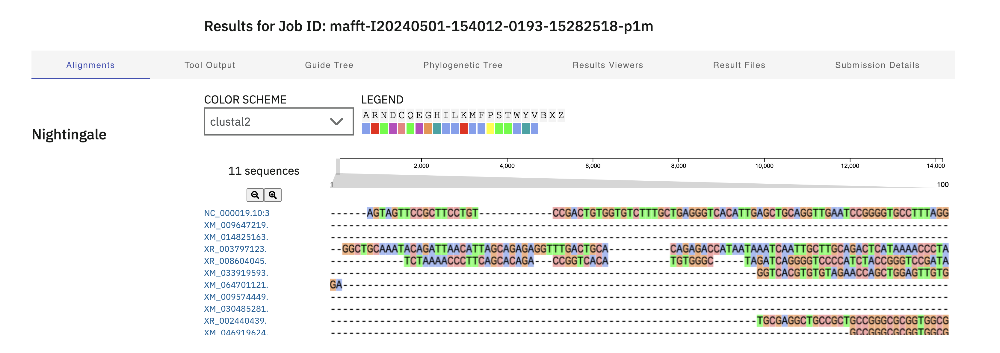

# Вопросы для разминки

### Какой ближайший таксон объединяет:
1. Человека и мышь: Euarchontoglires
2. Человека и бабочку: Bilateria
3. Человека и дрожжи: Opisthokonta
4. Человека и капусту: Eukaryota

### Согласно схеме http://tolweb.org/Eukaryotes/3, какой из организмов является ближайшим к человеку, а какой самым удаленным от человека:

(1 - самое близкое, 4 - самое удаленное)

1. Дизентерийная амеба
2. Эвглена зеленая
3. Фитофтора
4. Ламинария сахаристая

# Домашнее задание 2

### 1. Взял человеческий ген COX6B1: https://www.ncbi.nlm.nih.gov/gene/1340

### 2. Запустил поиск в BLAST (https://blast.ncbi.nlm.nih.gov/Blast.cgi) со следующими параметрами:
    Database - Standard databases (nr etc.)

    Optimize for - Highly similar sequences (megablast)

    Exclude - mammals (taxid:40674)

### 3. Гомологичные гены:

    | Number | Name                            | Russian name                 | Description                                                                                | Per. Ident |
    |--------|---------------------------------|------------------------------|--------------------------------------------------------------------------------------------|------------|
    | 1      | Scleropages formosus            | Аравана азиатская            | PREDICTED: Scleropages formosus uncharacterized LOC114909130 (LOC114909130), ncRNA         | 100.00%    |
    | 2      | Geotrypetes seraphini           | Геотрипетес серафини         | PREDICTED: Geotrypetes seraphini claudin domain-containing protein 1-like (LOC117348016)   | 93.62%     |
    | 3      | Strigops habroptila             | Какапо                       | PREDICTED: Strigops habroptila ribosomal protein S29 (RPS29), mRNA                         | 93.62%     |
    | 4      | Amphiprion ocellaris            | Клоун оцеллярис              | PREDICTED: Amphiprion ocellaris uncharacterized LOC129350593 (LOC129350593),               | 92.11%     |
    | 5      | Numida meleagris                | Обыкновенная цесарка         | PREDICTED: Numida meleagris leucine rich repeat protein 1 (LRR1), transcript variant X3    | 92.00%	    |
    | 6      | Gallus gallus                   | Банкивская джунглевая курица | PREDICTED: Gallus gallus leucine rich repeat protein 1 (LRR1), transcript variant X2, mRNA | 92.00%	    |
    | 7      | Zonotrichia leucophrys gambelii | Белоголовая зонотрихия       | PREDICTED: Zonotrichia leucophrys gambelii cytochrome c oxidase subunit 6B1 (LOC135441563) | 91.89%	    |
    | 8      | Fulmarus glacialis              | Глупыш                       | PREDICTED: Fulmarus glacialis cytochrome c oxidase subunit 6B1 (LOC104074365)              | 91.89%	    |
    | 9      | Egretta garzetta                | Малая белая цапля            | PREDICTED: Egretta garzetta protein GVQW1-like (LOC104121732), partial mRNA                | 91.58%	    |
    | 10     | Priapulus caudatus              | Кактусовый червь             | PREDICTED: Priapulus caudatus protein GVQW1-like (LOC106820658), partial mRNA              | 90.91%	    |

### 4. Множественное выравнивание

    
    Результаты выравнивания в файле [alignment.aln-clustalw](alignment.aln-clustalw)

### 5. Краткий анализ консервативности полученного выравнивания в произвольной форме

    Анализ консервативности выравнивания генов на основе percent identity matrix (matrix.txt) показывает, что некоторые участки последовательностей сильно консервативны, то есть сохраняются практически неизменными в ходе эволюции, в то время как другие участки более изменчивы. Например, последовательности XM_009647219.2 и NC_000019.10_35 имеют высокий процент идентичности (92.49%), что может указывать на их схожесть и возможно общую функциональность.

    С другой стороны, участки с более низким процентом идентичности, такие как между XM_009574449.1 и XM_030485281.1 (40.62%), могут указывать на более значительные изменения в этих генах или на их эволюционную дистанцию.
    
    Таким образом, анализ консервативности выравнивания генов позволяет выявить участки, которые подвержены сильным эволюционным ограничениям и могут играть важную роль в функциональности этих генов.

### 6. Объединяющий таксон: 

    Самая длинная общая последовательность: cellular organisms; Eukaryota; Opisthokonta; Metazoa; Eumetazoa; Bilateria
    
    Следовательно, объединяющий таксон: Bilateria
    
    Двусторо́нне-симметри́чные, или билатера́льные, или билате́рии (лат. Bilateria), — таксон, включающий настоящих многоклеточных животных, характеризующихся наличием передне-задней оси тела, систем органов и чётко определённой или истинной эндодермальной мезодермой.
    
    Характерная особенность строения большинства Bilateria — двусторонняя симметрия, при которой тело организма можно разделить на левую и правую половины, зеркально повторяющие друг друга

