# Домашнее задание 3

Изначально я выбрал OpenStructure в качестве инструмента визуализации. Долго промучался, даже пытался сделать визуализацию, используя предоставленный ими docker-контейнер, но даже внутри него были проблемы с импортами их же библиотек (ost дефолтный работает для загрузки протеина, а сам gfx для визуализации - нет).

Поэтому я решил сохранить себе sanity и взял ChimeraX (https://www.cgl.ucsf.edu/chimerax/), так как в табличке он занят только одним человеком, у которого тоже не заладились дела с OpenStructure.

Выбранная структура белка - https://www.rcsb.org/structure/6IR1

# Описание способа получения визуализации в выбранном ПО
В выбранном ПО есть готовые пресеты, которые можно применить простым нажатием без дополнительных настроек.
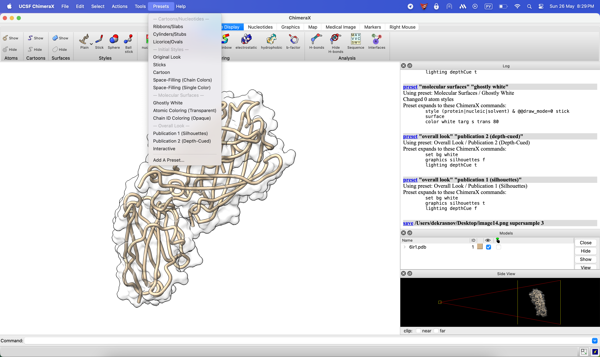

Так же можно вручную выбрать что и как мы хотим раскрасить, чтобы сделать это чем-то похожим на желаемый конечный вид.
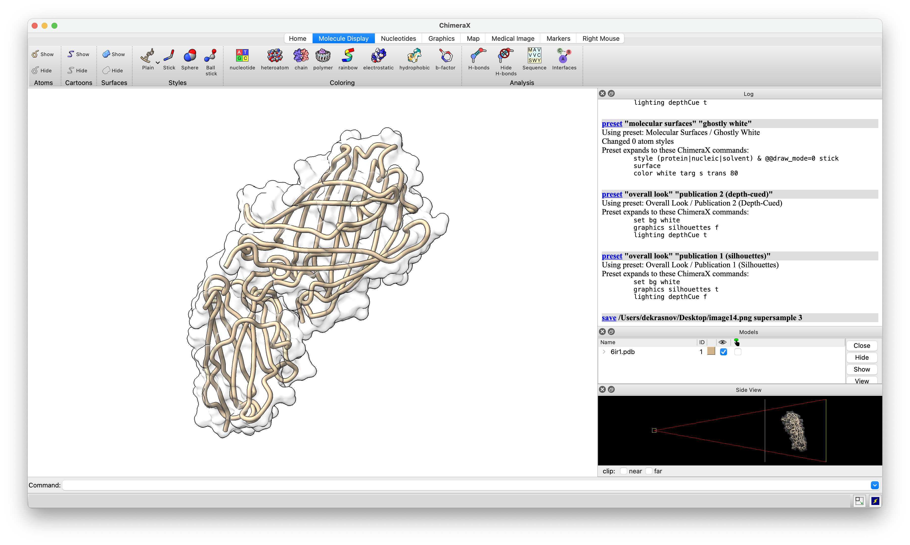

# Визуализации

## Wireframe
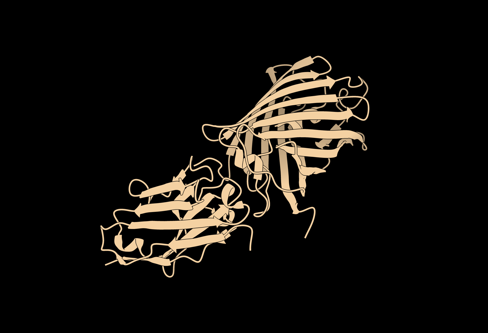

## Backbone
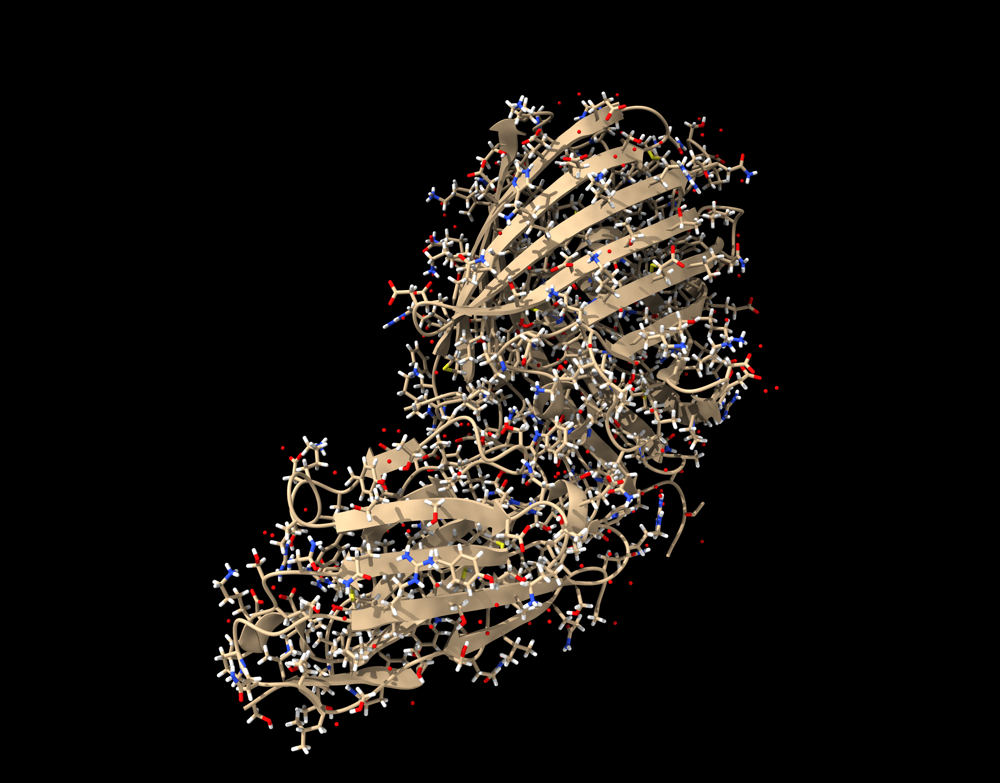

## Spacefill
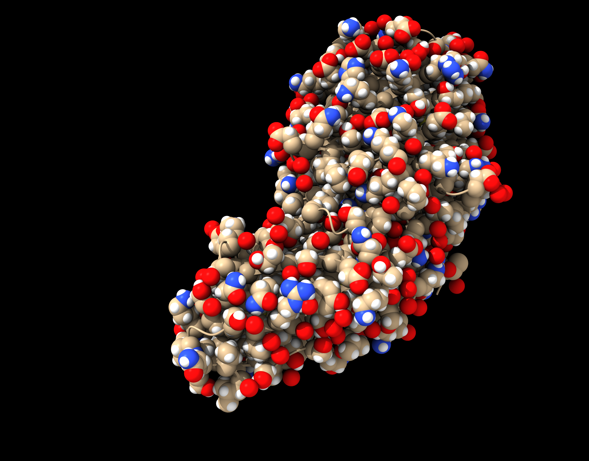

## Ribbons
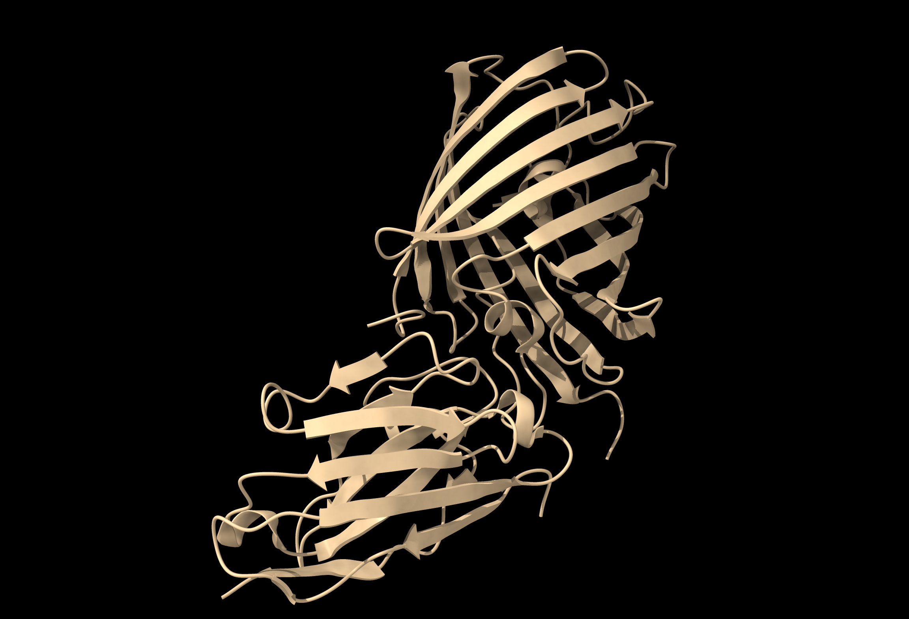

## Molecular surface
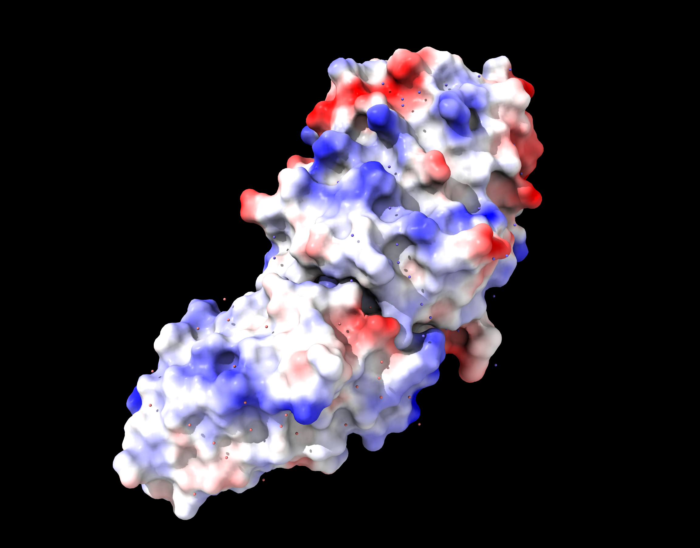

## Cylinders
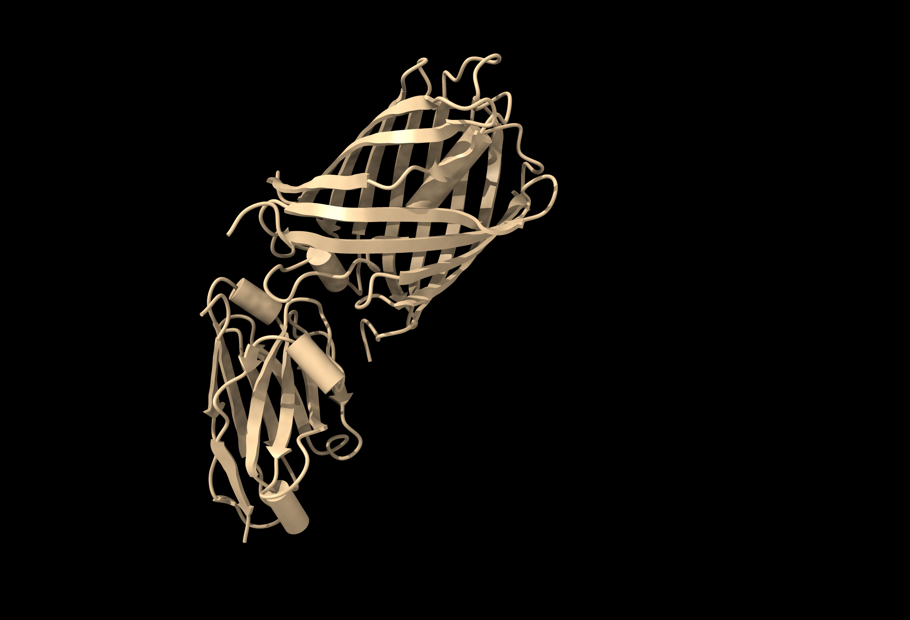

## Выполнить раскраску структуры цветовой моделью СРК
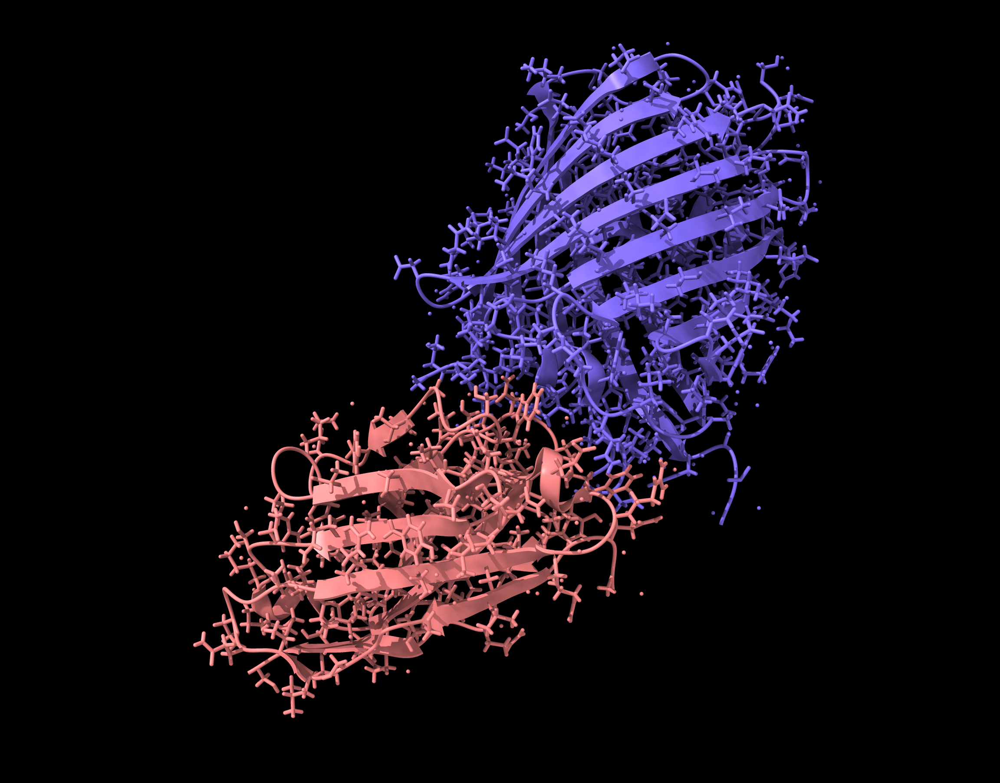

## Различными цветами по доменам (частям) белка
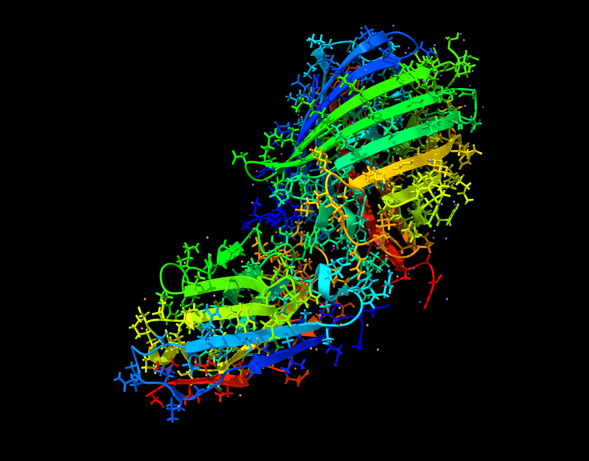

## Визуализация публикационного качества
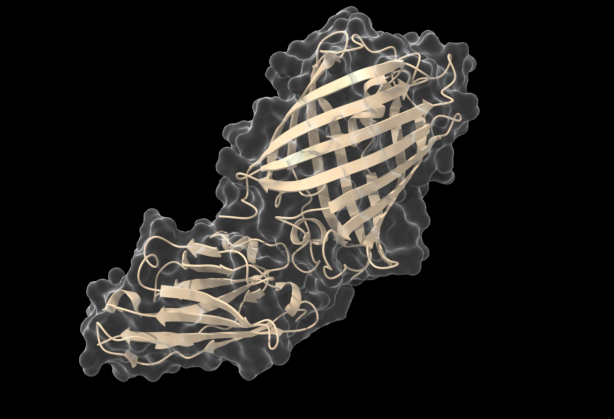
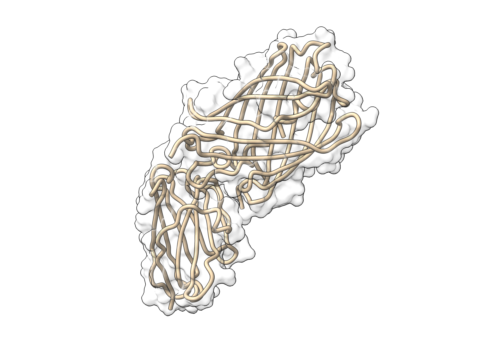