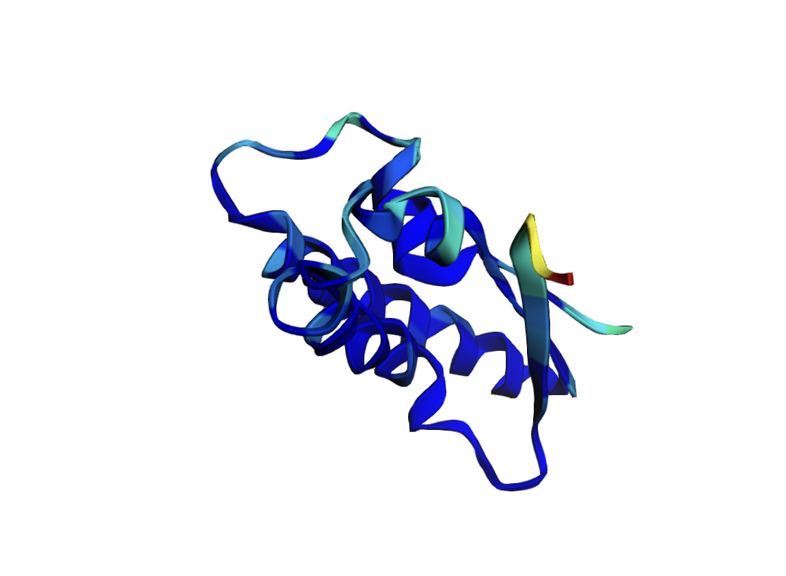
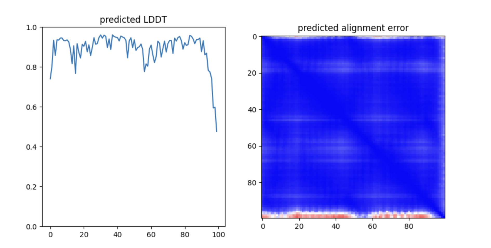
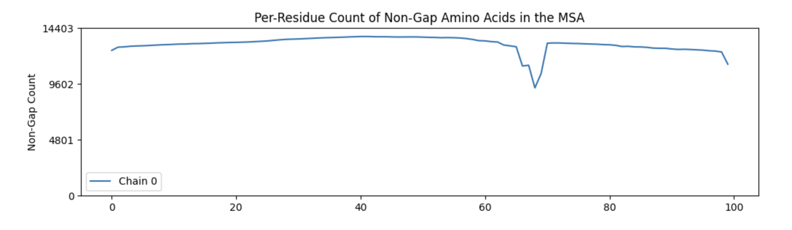
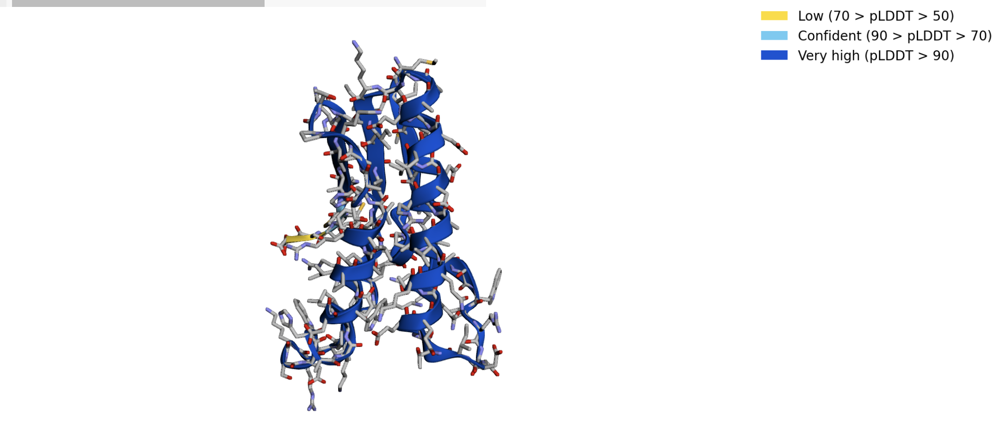
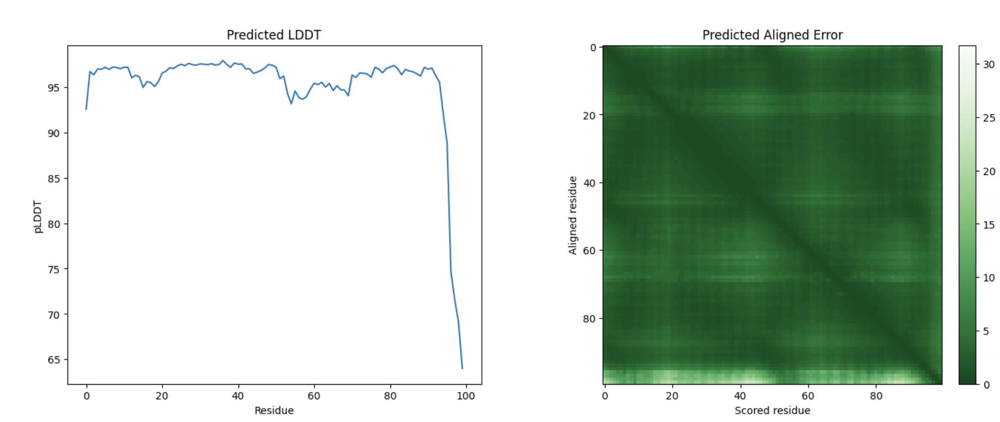
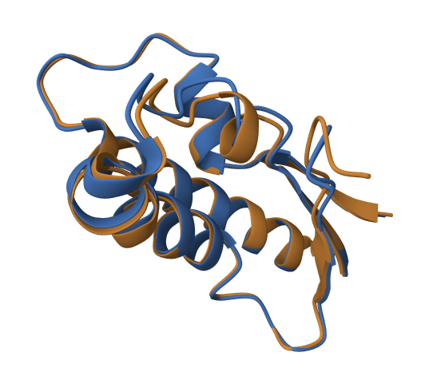

# Домашнее задание 5

### Последовательность
MKGMLTGPVTILNWSWPREDITHEEQTKQLALAIRDEVLDLEAAGIKIIQIDEAALREKLPLRKSDWHAKYLDWAIPAFRLVHSAVKPTTQIHTHMCYSE

## RoseTTAFold2

Результаты находятся в prediction_RoseTTAFold2/rf2_seed0_00_pred.pdb

Сам ноутбук - prediction_RoseTTAFold2/RoseTTAFold2_Krasnov_21215.ipynb

## OpenFold

Результаты в prediction_OpenFold/selected_prediction.pdb

Ноутбук - prediction_OpenFold/OpenFold_Krasnov_21215.ipynb

## Парное выравнивание методом jFATCAT (flexible)

### [Результаты выравнивания доступны по ссылке](https://www.rcsb.org/alignment?request-body=eJyVkU1uAyEMhe%2FCOmR%2BGsJ0dj1HVSEPmARpgCl4mkRR7l5Iqm5aqeoO%2Bdm8z89X9r5iurDxyuJCLoZcnwlpTUFlLGLQqAwQsNHCnPG2YToGwjPVRh8NspEt4NLJZWQb5pGO0VQtgK%2BaBdJA3M54dtNcWxZIRSJMDy%2BfjdIrRWvZ%2BLRhYBdlXKbvWrdv2w2zCQ4eA6kZw4GObByKF5xVWL2i4k3lM3ErdJnSqgs%2BlsLrla1pLhBHoiWPTbNmTHxd5ghmm3SetjEdmo%2BuMfEUarGRvQAhnwy3g0C%2BQ9nxZ9lPfMLO7jUa6IehSbYv2aBpVduqJaHZTtrZspmNyUMJhnn%2FKHxl8HNgMVORM86oa%2Bo1CMgXr1yJjr2wssi%2F0Xd9r%2FeTkLyVcuA7EIIPOy35XnR2GAxYIaF5OKK5U7i791%2Fwv438if9WT2HdfL%2FC2%2B0TVynRIw%3D%3D&response-body=eJzVVclu20gQ%2FReeSan3RTch0liEqBlZImwEwYBokU2ZABeFixPD8L9PNeVFMzESJDkNBAHsWl7Vq3pNPnpFnTfe7NEbhiLzZp6WTAuGaUA1ZQHLKA80S1UgtJZKIWYkkp7vdb3phw7iP%2Fy12UbLeOk9%2BV5le%2BOgTFkc68rWfVI1mYWgkynaL0VnIfHCZ%2Fu7xpXMTZ%2BaPshL%2B7U4lNYhtbYbyh7wPz1CqXZI%2BwFM43FoS8i56%2FtTN5tOh862wXAqG5NN2rQ7TJr2OL3H06z5UjvjFDNkDkqqQGZpGjBKdaCNygOKhFaYmdxwMm1zknTWZihBKDm1Npsc0iKHbvOmrUwP9arqbCi65FDUpn3wZtCW9b3aVI7htwin7ODmZEub9kVTj3PpHqpknPLce3ryf5oLV4opleGAHYQOmMjyQGcUB7lGHEixNJdyeq5os7GLYqz902zew%2Fghn7%2F9t1Ulr2sed9baI6S4%2FX36d5bvHewRBvd5NODzsagz%2B9WbId8rbX3s78CBEMD%2FRi701rem7s4TeOkF%2B%2Bj59%2B4TVAzQhFCOCEEMaaYpYtpHE8EU5RQrLiVcEu5DlCQMcyEQlZxgzEeUieJMcrBjRoUQXLtAgoXiVGnMidJCCmdjEnKR5khhLLVmkOysgkjJCCGUKYSpPJfRClEE95BqrNBo44gSLDElAIcZVBlLI0WoFJgIKamUyg%2FEhCgMgBBOGVxwqDLhimoBTCRFiCtBgbPb4lBVoybg7qXNy727N%2BUA2gD2MOr%2B4eR0stvsF54T8rOTKAGkX91dURWlaYv%2BIRiBPKeRGrRRJ4BaZINN3JuhOy9pFJD9PNg6%2Fa9%2BXsyAuVlfbaL4ansTh9Gft%2Fvb7W65COPVcnkdr6%2BjeTQPd4vlTbSIlvP5VbgOw%2BtwAY%2FRbrmOttFuvV%2Fcrubrj9Hidh5u53%2FsopvVfn6z3sbxdbiKV5sPH%2FdLz79Q7K%2BLzg3mf9r5j1TwJoEXgkGRwbZg1Zd6AMHSXxfLJY6Wr4Hx5tuAd%2Fp5w%2Fuu7JzHfaVKeNs9ex1T54H%2FWZJjKgzoOcGd0ubetuZoL0JBwE%2F%2FAHCXPg0%3D&encoded=true)

Так же результаты можно посмотреть в директории alignment_results

# Вывод

RMSD составляет 0.73, что указывает на очень малое отклонение между моделями.
TM-score равен 0.97, что близко к 1. Identity = 100%. Это указывает на практически идеальное совпадение.
