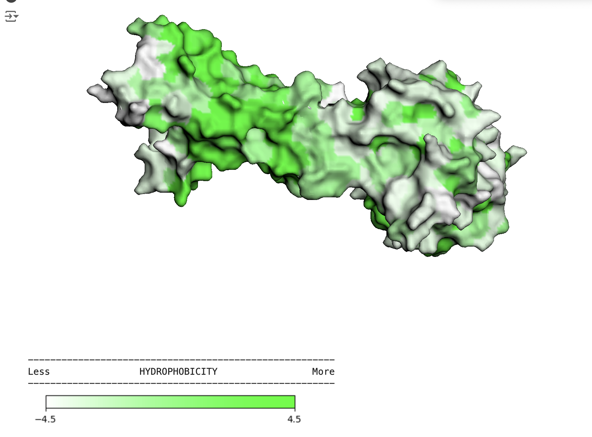
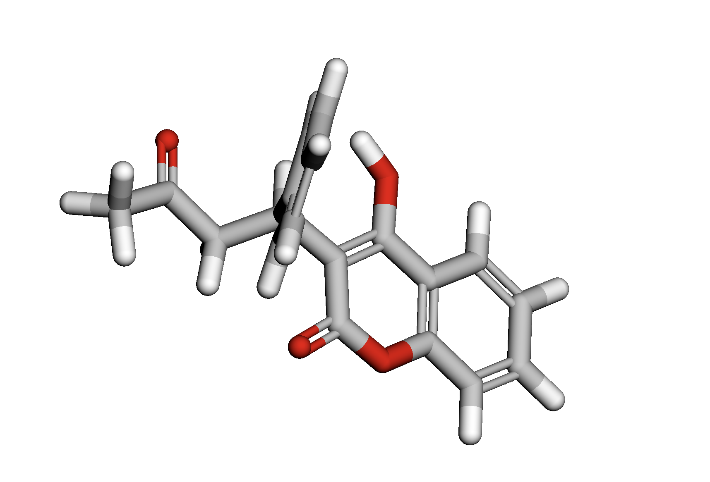
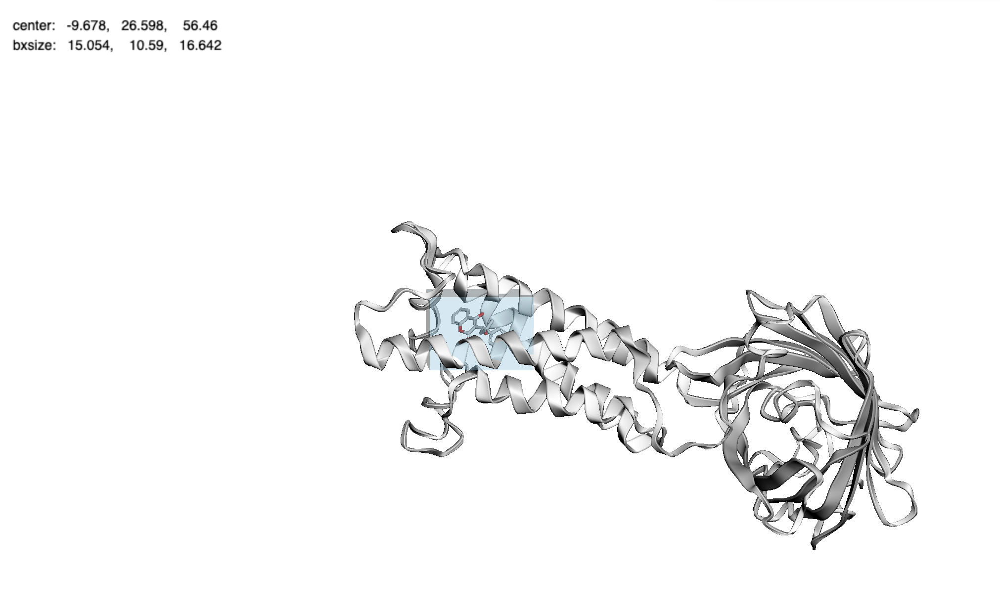
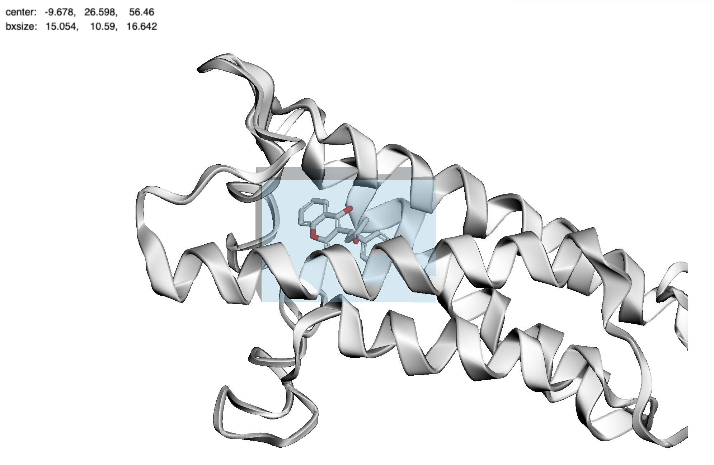
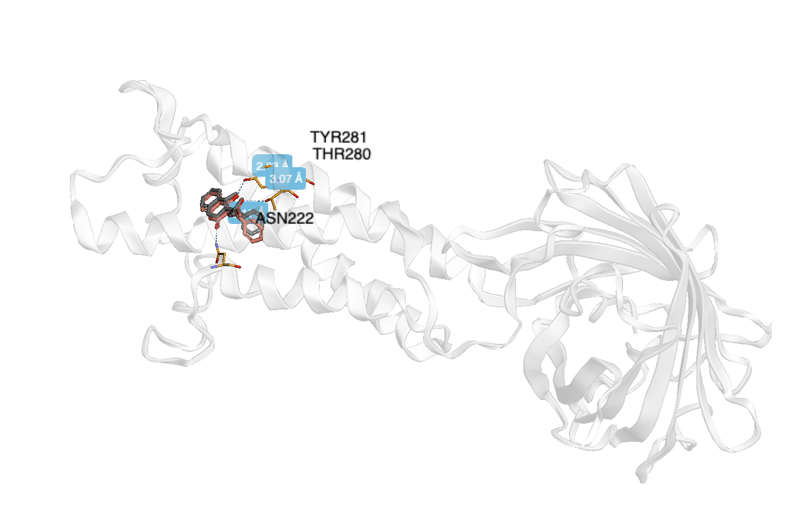
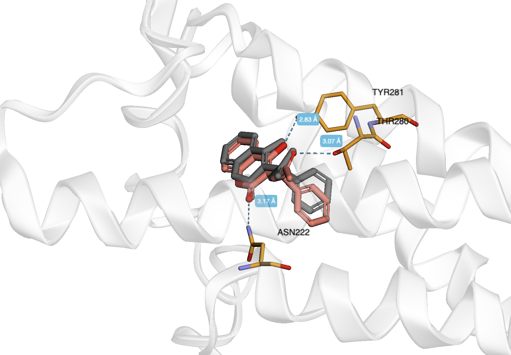

# Домашнее задание 6

## Варфарин

### Действующее вещество

Варфарин (Warfarin) – это и есть действующее вещество препарата.

### Область применения

Варфарин является антикоагулянтом, то есть веществом, предотвращающим образование тромбов.

Показания для применения:
- Лечение и профилактика тромбоза и эмболии кровеносных сосудов: острый венозный тромбоз и эмболия легочной артерии
- послеоперационный тромбоз
- повторный инфаркт миокарда
- в качестве дополнительного средства при проведении хирургического или медикаментозного (тромболитического) лечения тромбоза, а также при электрической кардиоверсии мерцательной аритмии
- рецидивирующий венозный тромбоз
- повторная эмболия легочной артерии
- протезирование клапанов сердца и сосудов (возможна комбинация с ацетилсалициловой кислотой)
- тромбоз периферических, коронарных и мозговых артерий
- вторичная профилактика тромбоза и тромбоэмболии после инфаркта миокарда и при мерцании предсердий

###  Молекулярный механизм действия
Варфарин ингибирует фермент витамин K-эпоксид редуктазу (VKORC1), который необходим для регенерации активного витамина К.
Витамин К участвует в синтезе факторов свертывания крови (II, VII, IX, X). Под действием варфарина уменьшается синтез этих факторов, что снижает свертываемость крови и предотвращает образование тромбов.

## Ноутбуки с вычислениями

Локально в файле: [homework6_Krasnov_21215.ipynb](https://github.com/peyuaa/bioinformatics_nsu/blob/main/homework6/homework6_Krasnov_21215.ipynb)

Google Collab: https://colab.research.google.com/drive/1YWo9SaQyCb015qTm_OU4e4Pq4ZGIjLPp?usp=sharing

## Полученный результат докинга

Находится в [DOCKING/6WV3](https://github.com/peyuaa/bioinformatics_nsu/tree/main/homework6/DOCKING/6WV3)

## Изображения

Трехмерная структура подготовленного таргета

Трехмерная структура лиганда

Полученный бокс

Докинг

